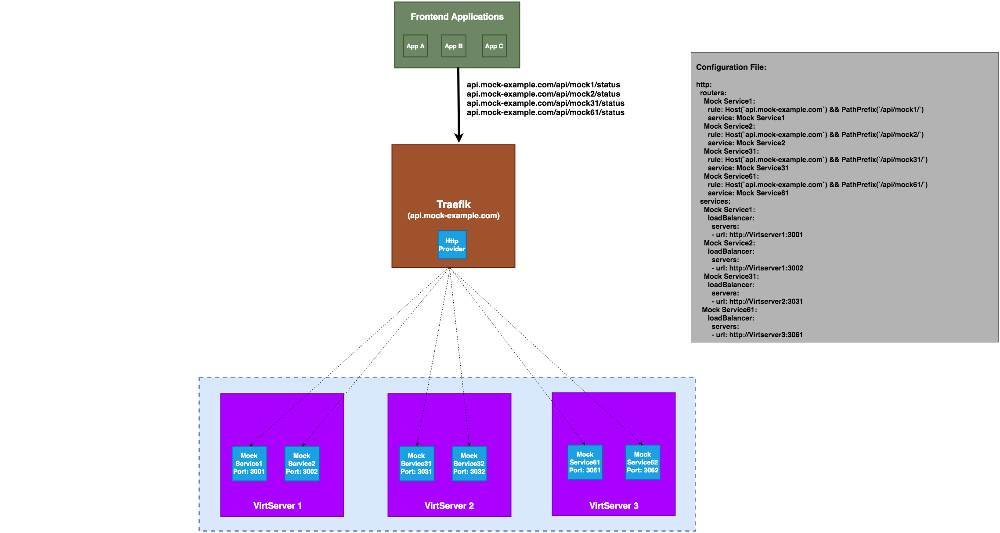

# Traefik HTTP provider plugin for ReadyAPI VirtServer

## Problem statement

  [ReadyAPI Virtualization](https://support.smartbear.com/readyapi/docs/virtualization/intro/about.html) is used for creating API Mock services.
  It have server side component called [VirtServer](https://support.smartbear.com/virtserver/docs/intro.html) which is used to deploy and run API Mock services.

  In VirtServer, every Mock service runs with own port. If we have 100 API microservices then we may need to create 100 Mock services and all these 100 mock services runs on own TCP port (3000, 3001,..3100).

  Example, If we have 100 Mock services and 3 VirtServers, assume every VirtServer running 35 Mock services.

  Without Traefik,
    http://server1:3001/api/mock1
    http://server2:3002/api/mock2
    ......
    http://server3:3100/api/mock3

Its very difficult to maintain many Mock services across many VirtServers. If we want to utilize a mock service mock1 in our frontend applications then we need to check all the VirtServers to find where the mock1 mock service running and its port number.

Also If we want to use a load balancer in front of these 3 VirtServer nodes, then we need to update the load balancer configuration file manually whenever new mock service is deployed in any VirtServers and its tedious process.

## Solution

To manage this scenario effectively, I am going to use [Traefik](https://traefik.io/) and its [Dynamic Configuration](https://doc.traefik.io/traefik/providers/overview/) feature using [HTTP provider](https://doc.traefik.io/traefik/providers/http/).

What sets Traefik apart, besides its many features, is that it automatically discovers the right configuration for your services. You can provide
the dynamic configuration via an HTTP(S) endpoint.

I have created [this](Traefik-HTTP-provider-plugin-for-ReadyAPI-VirtServer) HTTP provider to automatically generate the dynamic configuration for Traefik. We don't need to update the Traefik configuration each time the new mock service is deployed into VirtServers, this provider will detect newly deployed mock service configurations(Name, Path and Port number) and then generate the dynamic configuration for Traefik.
